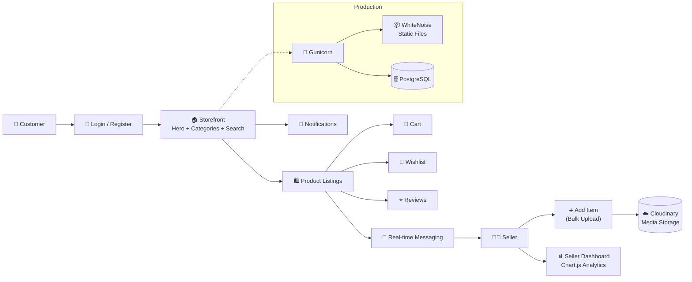

<div align="center">


<br/>

[](https://ecommerce-iyil.onrender.com)
[](https://github.com/nawabsakib5/Ecommerce/stargazers)
[](https://github.com/nawabsakib5/Ecommerce/commits/main)
[](#-status)

</div>

---

## 🛍️ About The Project

**Cado Fashion** (repo: `Ecommerce`) is a full-stack **fashion e-commerce platform** built with **Python & Django** — originally started as *Puddle*, a second-hand marketplace prototype, and iteratively evolved into a full retail storefront for verified sellers across Bangladesh. Customers can browse curated categories (Men's, Baby items, Children's Drop Shoulders, Clothing, Adults Drop Shoulders), search products, add items to a cart or wishlist, leave reviews, message sellers in real time, and sellers get their own dashboard with **Chart.js**-powered analytics.

<div align="center">

</div>

---

## 📚 Table of Contents

- [🖥️ Preview](#️-preview)
- [✨ Features](#-features)
- [🏗️ Architecture](#️-architecture)
- [📁 Project Structure](#-project-structure)
- [🛠️ Tech Stack](#️-tech-stack)
- [🚀 Getting Started](#-getting-started)
- [⚙️ Environment Variables](#️-environment-variables)
- [☁️ Deployment](#️-deployment)
- [🔒 Security](#-security)
- [🗺️ Roadmap](#️-roadmap)
- [👤 Author](#-author)

---

## 🖥️ Preview

<div align="center">

| Home / Storefront |
|:---:|
| Hero banner, category quick-filters, live search, "Just Dropped" & "Trending Now" panels, and a latest-items feed — all in a clean, dark-accented storefront UI. |

</div>

---

## ✨ Features

<table>
<tr>
<td width="50%" valign="top">

### 🏬 Storefront & Browsing
Hero promo banners, category quick-filter chips (Men's, Baby, Kids, Clothing), and a live search bar across products, brands & categories.

### 🛒 Cart & Wishlist
Add products to cart or save them to a wishlist for later.

### ⭐ Reviews
Customers can leave reviews on purchased or listed products.

### 🔔 Notifications & Inbox
In-app notification bell + real-time messaging between buyers and sellers.

</td>
<td width="50%" valign="top">

### 📦 Seller Tools
"+ Add Item" flow for sellers to list products, plus bulk-upload support via a custom Django management command that pushes images/videos straight to **Cloudinary**.

### 📊 Analytics Dashboard
Seller dashboard with **Chart.js**-powered sales/activity visualizations.

### 👥 Buyer / Seller Roles
Role-aware access — separate flows for people browsing vs. people listing products.

### 🔐 Secure Auth
Full login / logout / dashboard access control.

</td>
</tr>
</table>

---

## 🏗️ Architecture



---

## 📁 Project Structure

```text
Ecommerce/
└── puddle/                # Root directory (deployed on Render)
    ├── core/               # Home page & base templates
    ├── item/               # Product listings — add, edit, delete, bulk upload
    ├── conversation/       # Real-time buyer–seller messaging
    ├── dashboard/          # Seller dashboard + Chart.js analytics
    ├── templates/          # Shared HTML templates
    ├── puddle/             # Django project settings & URLs
    ├── requirements.txt
    └── manage.py
├── Procfile                # Gunicorn start command for deployment
├── .gitignore               # Hardened after full security audit
└── requirements.txt
```

---

## 🛠️ Tech Stack

| Layer | Technology |
|---|---|
| **Backend** |    |
| **Frontend** |     |
| **Media Storage** |  |
| **Static Files** |  |
| **Database** |  |
| **Hosting** |  |

---

## 🚀 Getting Started

### ✅ Prerequisites


### 📦 Installation

```bash
# 1. Clone the repository
git clone https://github.com/nawabsakib5/Ecommerce.git
cd Ecommerce

# 2. Create & activate a virtual environment
python3 -m venv env
source env/bin/activate        # Windows: env\Scripts\activate

# 3. Install dependencies
pip install -r puddle/requirements.txt

# 4. Apply migrations
cd puddle
python manage.py migrate

# 5. Start the development server
python manage.py runserver
```

Open your browser and go to → **`http://127.0.0.1:8000`** 🎉

---

## ⚙️ Environment Variables

Create a `.env` file inside `puddle/` — never commit this file:

```env
SECRET_KEY=your-django-secret-key
DEBUG=True
DATABASE_URL=your-database-url
CLOUDINARY_CLOUD_NAME=your-cloud-name
CLOUDINARY_API_KEY=your-api-key
CLOUDINARY_API_SECRET=your-api-secret
```

---

## ☁️ Deployment

<div align="left">

</div>

Live at **[ecommerce-iyil.onrender.com](https://ecommerce-iyil.onrender.com)** — deployed on **Render** with:
- Root directory set to `puddle`
- **Gunicorn** as the production WSGI server
- **Cloudinary** for all product image/video storage
- **WhiteNoise** for serving static files

> Originally deployed on Railway; migrated to Render after Railway's free tier expired. A future move to a self-hosted home server is planned.

---

## 🔒 Security

A full security audit was performed on this repository:
- ✅ Removed all hardcoded secrets from source
- ✅ Cleaned git history with `git filter-repo`
- ✅ Added a proper, hardened `.gitignore`
- ✅ Secrets now loaded exclusively via environment variables

---

## 🗺️ Roadmap

- [ ] 💳 Full checkout & payment gateway integration
- [ ] 📦 Order tracking & history
- [ ] ⭐ Verified seller badges
- [ ] 📱 Mobile app companion
- [ ] 🏠 Migrate hosting to self-hosted home server

---

## 👤 Author

<div align="center">


**Mohammad Sakib**
BSc in CSE — Habibullah Bahar University College, Bangladesh

[](https://github.com/nawabsakib5)

</div>

---

<div align="center">

</div>
