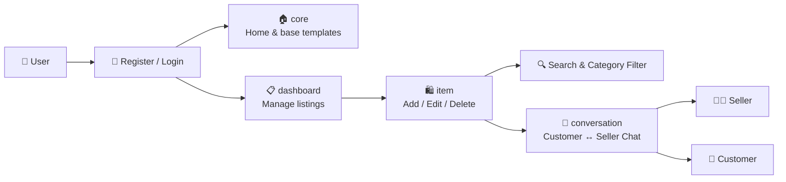

<div align="center">


<br/>

[](https://github.com/nawabsakib5/Ecommerce/stargazers)
[](https://github.com/nawabsakib5/Ecommerce/network/members)
[](https://github.com/nawabsakib5/Ecommerce/commits/main)
[](#-status)

</div>

---

## 🛒 About The Project

**Cado** is a scalable, full-stack **e-commerce platform** built with **Python & Django**, where users can browse and search products, list and manage items for sale, message sellers about products, and manage everything from a personal dashboard. It's designed with secure authentication and a clean, dynamic product-management flow for a seamless shopping experience.

<div align="center">

</div>

---

## 📚 Table of Contents

- [✨ Features](#-features)
- [🏗️ Architecture](#️-architecture)
- [📁 Project Structure](#-project-structure)
- [🛠️ Tech Stack](#️-tech-stack)
- [🚀 Getting Started](#-getting-started)
- [📖 Usage](#-usage)
- [🚧 Status](#-status)
- [🗺️ Roadmap](#️-roadmap)
- [👤 Author](#-author)

---

## ✨ Features

<table>
<tr>
<td width="50%" valign="top">

### 🔐 Secure Authentication
Full registration, login & logout flow built on Django's auth system.

### 🖼️ Product Management
Add, edit, and delete product listings — complete with images, price & category.

### 🔍 Search & Filter
Find products instantly by name, description, or category.

</td>
<td width="50%" valign="top">

### 💬 Customer–Seller Messaging
Built-in conversation system so customers and sellers can chat about products without leaving the platform.

### 📋 Personal Dashboard
Manage all your own listings from a dedicated user dashboard.

### 🎨 Modern UI
Styled with **Tailwind CSS** for a fast, responsive, clean shopping experience.

</td>
</tr>
</table>

---

## 🏗️ Architecture



---

## 📁 Project Structure

```text
Ecommerce/
└── puddle/
    ├── core/             # Home page & base templates
    ├── item/             # Product listings — add, edit, delete
    ├── conversation/     # Messaging between customers & sellers
    ├── dashboard/        # User dashboard
    ├── templates/        # Shared HTML templates
    ├── puddle/           # Project settings & URLs
    ├── requirements.txt
    └── manage.py
├── Procfile              # Deployment process config
└── requirements.txt
```

---

## 🛠️ Tech Stack

| Layer | Technology |
|---|---|
| **Backend** |   |
| **Frontend** |   |
| **Database** |  |
| **Auth** | Django built-in authentication |

---

## 🚀 Getting Started

### ✅ Prerequisites


### 📦 Installation

```bash
# 1. Clone the repository
git clone https://github.com/nawabsakib5/Ecommerce.git
cd Ecommerce

# 2. Create & activate a virtual environment
python3 -m venv env
source env/bin/activate        # Windows: env\Scripts\activate

# 3. Install dependencies
pip install -r puddle/requirements.txt

# 4. Apply migrations
cd puddle
python manage.py migrate

# 5. Start the development server
python manage.py runserver
```

Open your browser and go to → **`http://127.0.0.1:8000`** 🎉

---

## 📖 Usage

1. 📝 Register a new account or log in
2. 🏷️ List products for sale with images, price & category
3. 🔍 Browse or search products by name or category
4. 💬 Contact sellers via the built-in messaging system
5. 📋 Manage your listings from your personal dashboard

---

## 🚧 Status

> Under active development — new features being added regularly.

---

## 🗺️ Roadmap

- [ ] ⭐ Ratings & reviews for products
- [ ] 💳 In-app payment / checkout flow
- [ ] 🛒 Shopping cart & order history
- [ ] 📱 Mobile-responsive polish
- [ ] 🔔 Real-time chat notifications

---

## 👤 Author

<div align="center">


**Mohammad Sakib**
BSc in CSE — Habibullah Bahar University College, Bangladesh

[](https://github.com/nawabsakib5)

</div>

---

<div align="center">

</div>
